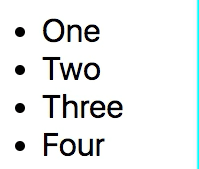
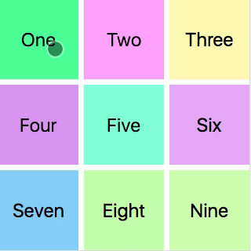
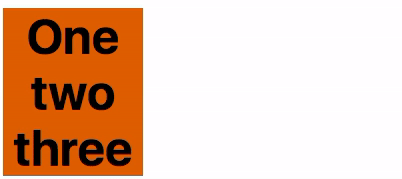

# mjukna

[](https://travis-ci.org/daniel-lundin/mjukna)
[](https://unpkg.com/mjukna/dist/browser.js)

Library for animating layout changes perfomantly using the [FLIP technique](https://aerotwist.com/blog/flip-your-animations/)

Use cases:

 - List reordering
 - DOM node additions/removals
 - Shared element transitions
 - Animating "unanimatable" CSS properties(e.g. `display`, `flex-direction`, `grid-template-rows`)

Highlights:

 - Smallish footprint(~2kB gzipped)
 - Handles nested DOM structures by compensation for parent transforms
 - Automatically detects DOM changes by leveraging [MutationObservers](https://developer.mozilla.org/en-US/docs/Web/API/MutationObserver)

## Installation

NPM:
`npm install mjukna`

CDN:
 - https://cdn.jsdelivr.net/npm/mjukna/dist/browser.js
 - https://unpkg.com/mjukna@0.3.0/dist/browser.js 

## Basic usage

```js
// Register all list items
mjukna(document.querySelectorAll('li'));

// Remove the first one one
document.querySelector('li').remove();
```

Will result in:



## API

### ```mjukna(element(s), options)```

#### Element

Type: `Element` | iterable of `Element`s | Array of objects


#### Options

Type: `object`

 - `staggerBy` - `Number` in milliseconds to delay each element with
 - `enterFilter` - predicate `function` that gets called for each element added to the DOM. Return `true` to run enter animation.
 - `enterAnimation` - Hook to run custom enter animations. The provided function will be called with to arguments, the element and a done callback.
 - `exitAnimation` - Same as `enterAnimation` but for removed DOM nodes
 - `spring` - Parameters for the spring physics

Example including all available options:
```js
{
  staggerBy: 20,
  enterFilter: (element) => element.classList.contains('list-item'),
  enterAnimation: (element, done) => externalLibFadeIn(element).then(done),
  exitAnimation:(element, done) => externalLibFadeOut(element).then(done),
  spring: {
    stiffness: 10,
    damping: 0.5
  }
}
```

## Shared element transitions

When an element enters the DOM, an anchor element can be set as the origin for element. The added element will be transformed to the same size/position as the anchor element and then animated to its normal position.

As an example, making a modal expand from a button might look something like this:

```js
mjukna({
  anchor: document.querySelector('modal-button'),
  element: () => document.querySelector('modal')
})

const modal = document.createElement('div');
modal.classList.add('modal');
document.body.appendChild(modal);
```



### Nested elements

One common problem when using FLIP animations is that nested content can get distorted, especially text content. This library solves this by keeping track of parent child relations and applies compensating transforms to child elements.

Say an element with a text element should double in width while the text should change from left-align to right. This can be achieved with the following mjukna code:

```css
.box {
  width: 200px;
  background: chocolate;
}

.box h2 {
  display: inline-block;
}

.box.big {
  width: 400px;
  text-align: right;
}
```

```html
<div class="box">
  <h2>Brown Fox</h2>
</div>
```

```js
mjukna(document.querySelectorAll('.box, .box h2'));
document.querySelector('.box').classList.add('big')
```

Note that we need to register both the parent and the child.

Also note that the example changes `width` and text-align, only the `transform`-property is changed by the library. That's the magic of FLIP :)


### A note about text content

When animating text you need to keep two things in mind:

 - The containing element must fully enclose the text(e.g. inline-block)
 - If text in the first or the final position wraps multiple lines, each word needs to be wrapped in an inline-block element.


Example:
```css
.box {
  width: 70px;
  background: chocolate;
  text-align: center;
}

.box span {
  display: inline-block;
}

.box.big {
  width: 200px;
  font-size: smaller;
}
```

```html
<div class="box">
  <h2><span>One</span> <span>two</span> <span>three</span></h2>
</div>
```

```js
mjukna(document.querySelectorAll('.box, .box span'));
document.querySelector('.box').classList.add('big')
```



### DEMOS

 - [Shared element transition(basic)](https://daniel-lundin.github.io/mjukna/anchor.html)
 - [Shared element transition(advanced)](https://daniel-lundin.github.io/mjukna/guitars.html)
 - [Grid animations](https://daniel-lundin.github.io/mjukna/numbers.html)
 - [List reordering](https://daniel-lundin.github.io/mjukna/list-reordering.html)

### Contact

Say hi on [Twitter](https://twitter.com/danielundin)

### LICENSE

[MIT](LICENSE.md)
